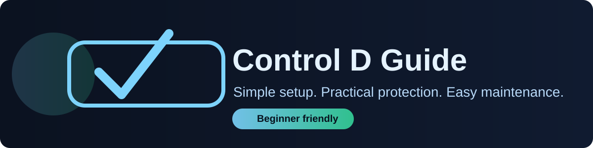

# Control D Guide

## Practical DNS filtering for everyday use

A practical, beginner-friendly guide to setting up and maintaining [Control D](https://controld.com/) with balanced filtering, Hagezi recommendations, troubleshooting, and maintainable custom rules.

Start with one profile, one device, and a moderate filter set. Learn how your configuration behaves before adding more rules or enabling more aggressive protection.

  <a class="button button-primary" href="getting-started.md">Start with the basics</a>
  <a class="button" href="starter-profiles.md">View starter profiles</a>
  <a class="button" href="cheat-sheet.md">Open the cheat sheet</a>

## The goal

Build a DNS setup that improves privacy and security while keeping the internet usable, understandable, and easy to maintain.

## Recommended starting point

| Start with | Why |
|---|---|
| One profile | Keeps troubleshooting straightforward |
| One device | Lets you test safely before expanding |
| Moderate filtering | Provides useful protection without unnecessary breakage |
| Narrow exceptions | Preserves protection everywhere else |

## Browse the guide

- [Getting Started](getting-started.md)
- [Profiles and Devices](profiles-and-devices.md)
- [Starter Profiles](starter-profiles.md)
- [Filters](filters.md)
- [Custom Rules](custom-rules.md)
- [Using Hagezi Lists](hagezi.md)
- [Troubleshooting](troubleshooting.md)
- [Maintenance](maintenance.md)

> This is an independent community guide, not official Control D documentation. Consult the [official documentation](https://docs.controld.com/) for current product details.
